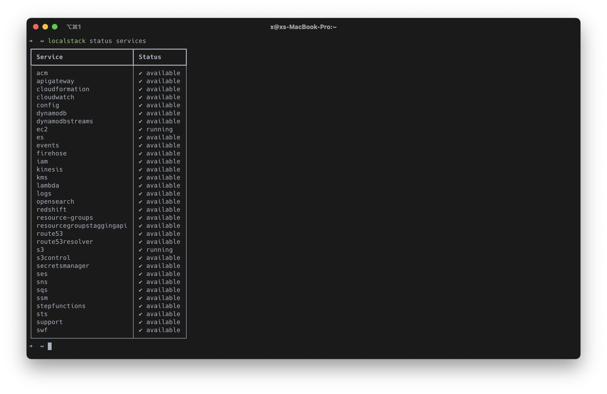

# Clojure AWS SDK for Java

* [AWS Services](#aws-services)
* [Local Development using AWS](#local-development-using-aws)
  * [Deploy Infrastructure using Terraform](#deploy-infrastructure-using-terraform)
* [Local Development using LocalStack](#local-development-using-localstack)
  * [Start LocalStack](#start-localstack)
  * [AWS CLI with LocalStack](#aws-cli-with-localstack)
* REPL Examples
  * [S3](docs/s3.md)
* [Sources](#sources)

## AWS Services
todo...

## Local Development using AWS
### Deploy Infrastructure using Terraform
Terraform is an infrastructure as code (IaC) tool that is used to
create and manage resources on cloud platforms and other services through 
their APIs. In this example, the AWS provider is used to interact with AWS 
resources. 
> Terraform version v1.2.4 _(on darwin_arm64)_

```shell
# Initialize terraform backend
terraform init

# Validate iac
terraform validate

# Create execution plan
terraform plan

# Apply infrastructre
terraform apply

# Destroy infrastructure
terraform destroy
```

## Local Development using LocalStack
### Start LocalStack
Start LocalStack inside a Docker container using LocalStack CLI.<br>
_Requirements: python3, pip, and Docker._
```shell
# Install 
pip install localstack 

# Start LocalStack
localstack start -d
> "LocalStack running on http://localhost:4566"

# See status of AWS services
localstack service status
```


### AWS CLI with LocalStack
```shell
# List S3 buckets
aws --endpoint-url=http://0.0.0.0:4566 s3api list-buckets 
aws --endpoint-url=http://0.0.0.0:4566 s3api list-buckets --query "Bucket[some-bucket]"

# List Lambda Functions 
aws --endpoint-url=http://0.0.0.0:4566 lambda list-functions 
```

## Sources
* [LocalStack](https://github.com/localstack/localstack)
* [Unknown host when using LocalStack](https://stackoverflow.com/questions/68034637/unknown-host-when-using-localstack-with-spring-cloud-aws-2-3)
